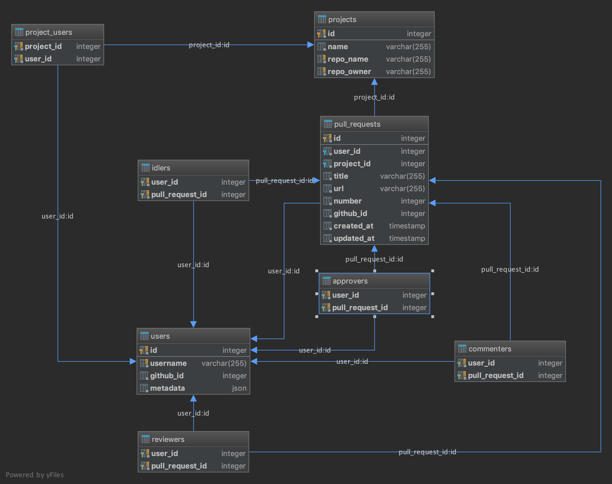

# Reviewer (specification)

## Table of Contents

  - [Overview](#overview)
  - [API](#api)
      - [Projects](#projects)
        - [Retrieve Projects](#retrieve-projects)
        - [Retrieve Project](#retrieve-project)
        - [Create Project](#create-project)
        - [Delete Project](#delete-project)
      - [Users](#users)
        - [Retrieve Users](#retrieve-users)
        - [Retrieve User](#retrieve-user)
        - [Update User](#update-user)
        - [Delete User](#delete-user)
      - [Pull Requests](#pull-requests)
        - [Retrieve Pull Requests](#retrieve-pull-requests)
        - [Retrieve Pull Request](#retrieve-pull-request)
  - [Scheduled Jobs](#scheduled-jobs)
  - [Database Model](#database-model)


## Overview

The Reviewer API defines an HTTP interface through which the management of GitHub Pull Requests can be managed and monitored.

## API

## Projects

A *Project* in the context of the Reviewer platform is just a GitHub repository with a certain number of pull requests associated with it.

### Retrieve Projects

#### Request

#### Route

`GET /v1/projects`

#### Response

| Status Code | Description |
| --- | --- |
| 200 OK | MUST be returned upon successful processing of this request. The expected response body is below. |

#### Body

The response body MUST be a valid JSON Object (`{}`).

```json
[
    {
        "id": 1,
        "name": "The Docker CLI",
        "repo_name": "cli",
        "repo_owner": "docker"
    },
    {
        "id": 2,
        "name": "Kubernetes Core",
        "repo_name": "kubernetes",
        "repo_owner": "kubernetes"
    },
    {
        "id": 3,
        "name": "JupyterLab computational environment",
        "repo_name": "jupyterlab",
        "repo_owner": "jupyterlab"
    }
]
```

### Retrieve Project

#### Request

#### Route

`GET /v1/projects/{id}`

#### Response

| Status Code | Description |
| --- | --- |
| 200 OK | The expected response body is below. |
| 404 Not Found | Will be returned if the project does not exist. |

#### Body

The response body MUST be a valid JSON Object (`{}`).

```json
{
    "id": 1,
    "name": "The Docker CLI",
    "repo_name": "cli",
    "repo_owner": "docker"
}
```

### Create Project

#### Request

#### Route

`POST /v1/projects`

#### Body

```json
{
	"name": "The Docker CLI",
	"repo_owner": "cli",
	"repo_name": "docker"
}
```

#### Response

| Status Code | Description |
| --- | --- |
| 201 Created | Will be returned if the project was created successfully as a result of this request. The expected response body is below. |
| 400 Bad Request | Will be returned if the request is malformed or missing mandatory data. |

#### Body

The response body MUST be a valid JSON Object (`{}`).

```json
{
    "id": 1,
    "name": "The Docker CLI",
    "repo_name": "cli",
    "repo_owner": "docker"
}
```

### Delete Project

#### Request

#### Route

`DELETE /v1/projects/{id}`

#### Response

| Status Code | Description |
| --- | --- |
| 204 No Content | The expected response body is below. |
| 404 Not Found | Will be returned if the project does not exist. |

#### Body

```json
{}
```

## Users

A *User* in the context of the Reviewer platform is just a GitHub user which can be an author of pull requests or be assigned to review certain ones.

### Retrieve Users

#### Request

#### Route

`GET /v1/users`

#### Response

| Status Code | Description |
| --- | --- |
| 200 OK | MUST be returned upon successful processing of this request. The expected response body is below. |

#### Body

The response body MUST be a valid JSON Object (`{}`).

```json
[
    {
        "id": 1,
        "username": "NickyMateev",
        "github_id": 15074116,
        "metadata": {}
    },
    {
        "id": 2,
        "username": "georgifarashev",
        "github_id": 3719060,
        "metadata": {}
    },
    {
        "id": 3,
        "username": "pankrator",
        "github_id": 4245946,
        "metadata": {}
    }
]
```

### Retrieve User

#### Request

### Query parameters

| Parameter | Description                                                                                    |
|-----------|------------------------------------------------------------------------------------------------|
| details   | Provides additional information regarding a user - approved, commented and idled pull requests |

#### Response

| Status Code | Description |
| --- | --- |
| 200 OK | The expected response body is below. |
| 404 Not Found | Will be returned if the user does not exist. |

#### Route

`GET /v1/users/{id}`

#### Body

The response body MUST be a valid JSON Object (`{}`).

```json
{
    "id": 1,
    "username": "NickyMateev",
    "github_id": 15074116,
    "metadata": {}
}
```

#### Route (with parameters)

`GET /v1/users/{id}?details=true`

#### Body 

```json
{
    "id": 1,
    "username": "NickyMateev",
    "github_id": 15074116,
    "metadata": {},
    "approved_pull_requests": [
          {
              "id": 32,
              "user_id": 12,
              "project_id": 2,
              "title": "Fix \"warning\" output on docker system prune",
              "url": "https://github.com/docker/cli/pull/1524",
              "number": 1524,
              "github_id": 231736127,
              "created_at": "2019-02-16T11:23:36.124622Z",
              "updated_at": "2019-02-16T09:23:57.380476Z"
          },
          {
              "id": 26,
              "user_id": 12,
              "project_id": 2,
              "title": "[WIP][18.09] Bump Golang 1.10.7",
              "url": "https://github.com/docker/cli/pull/1584",
              "number": 1584,
              "github_id": 239812031,
              "created_at": "2019-02-16T11:23:36.072845Z",
              "updated_at": "2019-02-16T09:23:55.837718Z"
          },
      ],
      "commented_pull_requests": [
         {
            "id": 21,
            "user_id": 25,
            "project_id": 2,
            "title": "Surfacing in the CLI's output when services or networks are marked for removal",
            "url": "https://github.com/docker/cli/pull/1613",
            "number": 1613,
            "github_id": 244543543,
            "created_at": "2019-02-16T11:23:36.000112Z",
            "updated_at": "2019-02-16T09:24:06.486835Z"
        },
        {
            "id": 22,
            "user_id": 27,
            "project_id": 2,
            "title": "Add support for maximum replicas per node without stack",
            "url": "https://github.com/docker/cli/pull/1612",
            "number": 1612,
            "github_id": 244504553,
            "created_at": "2019-02-16T11:23:36.021657Z",
            "updated_at": "2019-02-16T09:24:06.725251Z"
        }
      ],
      "idled_pull_requests": [
        {
            "id": 34,
            "user_id": 34,
            "project_id": 2,
            "title": "Specify the purpose of force option in volume rm",
            "url": "https://github.com/docker/cli/pull/1516",
            "number": 1516,
            "github_id": 230621103,
            "created_at": "2019-02-16T11:23:36.147619Z",
            "updated_at": "2019-02-16T09:23:57.762481Z"
        }
    ]
}
```

### Update User

Updating a *User* allows modifying only a User's metadata. The `metadata` property of a *User* allows
extending *User* entities with custom fields like for example `slack_id` on which the specific user should
be notified regarding Pull Request events.

#### Request

#### Route

`PATCH /v1/users/{id}`

#### Body

```json
{
  "metadata": {
    "slack_id": "UG12345"
  }
}
```

#### Response

| Status Code | Description |
| --- | --- |
| 204 No Content | The expected response body is below. |
| 400 Bad Request | Will be returned if the request is malformed or missing mandatory data. |
| 404 Not Found | Will be returned if the user does not exist. |


#### Body

```json
{}
```

### Delete User

#### Request

#### Route

`DELETE /v1/users/{id}`

#### Response

| Status Code | Description |
| --- | --- |
| 204 No Content | The expected response body is below. |
| 404 Not Found | Will be returned if the project does not exist. |

#### Body

```json
{}
```

## Pull Requests

*Pull Requests* are what you might expect - GitHub Pull Requests. There are only readonly APIs -
*Pull Requests* can only be created and updated internally.

### Retrieve Pull Requests

#### Request

#### Route

`GET /v1/pull_requests`

#### Response

| Status Code | Description |
| --- | --- |
| 200 OK | MUST be returned upon successful processing of this request. The expected response body is below. |

#### Body

The response body MUST be a valid JSON Object (`{}`).

```json
[
    {
        "id": 50,
        "user_id": 71,
        "project_id": 3,
        "title": "Cluster Autoscaler 1.3.7",
        "url": "https://github.com/kubernetes/kubernetes/pull/74136",
        "number": 74136,
        "github_id": 253474765,
        "created_at": "2019-02-16T11:23:37.476196Z",
        "updated_at": "2019-02-16T11:23:37.476196Z"
    },
    {
        "id": 51,
        "user_id": 60,
        "project_id": 3,
        "title": "OpenAPI code generation for sample-apiserver",
        "url": "https://github.com/kubernetes/kubernetes/pull/74133",
        "number": 74133,
        "github_id": 253433270,
        "created_at": "2019-02-16T11:23:37.520968Z",
        "updated_at": "2019-02-16T11:23:37.520968Z"
    },
    {
        "id": 52,
        "user_id": 77,
        "project_id": 3,
        "title": "Remove redundant if and else blocks",
        "url": "https://github.com/kubernetes/kubernetes/pull/74129",
        "number": 74129,
        "github_id": 253413273,
        "created_at": "2019-02-16T11:23:37.540383Z",
        "updated_at": "2019-02-16T11:23:37.540383Z"
    }
]
```

### Retrieve Pull Request

#### Request

### Query parameters

| Parameter | Description                                                                                                                  |
|-----------|------------------------------------------------------------------------------------------------------------------------------|
| details   | Provides additional information regarding a pull request - author name, approvers, commenters and idlers of the pull request |

#### Response

| Status Code | Description |
| --- | --- |
| 200 OK | The expected response body is below. |
| 404 Not Found | Will be returned if the user does not exist. |

#### Route

`GET /v1/pull_requests/{id}`

#### Body

The response body MUST be a valid JSON Object (`{}`).

```json
{
    "id": 32,
    "user_id": 12,
    "project_id": 2,
    "title": "Fix \"warning\" output on docker system prune",
    "url": "https://github.com/docker/cli/pull/1524",
    "number": 1524,
    "github_id": 231736127,
    "created_at": "2019-02-16T11:23:36.124622Z",
    "updated_at": "2019-02-16T09:23:57.380476Z"
}
```

#### Route (with parameters)

`GET /v1/pull_requests/{id}?details=true`

#### Body 

```json
{
    "id": 32,
    "user_id": 12,
    "project_id": 2,
    "title": "Fix \"warning\" output on docker system prune",
    "url": "https://github.com/docker/cli/pull/1524",
    "number": 1524,
    "github_id": 231736127,
    "created_at": "2019-02-16T11:23:36.124622Z",
    "updated_at": "2019-02-16T09:23:57.380476Z",
    "author": "thaJeztah",
    "approvers": [
        "vdemeester",
        "silvin-lubecki"
    ],
    "commenters": [
        "thaJeztah"
    ],
    "idlers": []
}
```

## Scheduled Jobs

The Reviewer platform schedules several jobs to work in the background during different periods of the day. The 
following table lists all jobs in ascending order with respect to the frequency of execution:

| Job                | Frequency          | Description                                                                                  |
|--------------------|--------------------|----------------------------------------------------------------------------------------------|
| PullRequestFetcher | Every 1h 30min     | Retrieves all the pull requests for each GitHub project that's persisted.                    |
| ReviewFetcher      | Every 15min        | Retrieves the reviews for each persisted pull request.                                       |
| IdlersReminder     | Every day @ 3:30PM | Sends Slack notifications to users who have not reviewed pull requests they are assigned on. |

> Notifcations are sent to the team's main channel when there's no information about a user's Slack ID in the database.
In order to specify a user's Slack ID so he can receive personal notifications, you must use the [*Update User API*](#update-user). 

## Database Model



> Additionally you can checkout the [*storage/migrations*](../storage/migrations) folder to see the DDL SQL commands that define the project schema.