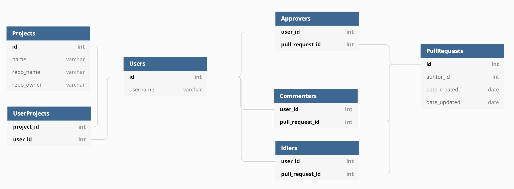

# Reviewer (specification)

## Table of Contents

  - [Overview](#overview)
  - [API](#api)
      - [Projects](#projects)
        - [Retrieve Projects](#retrieve-projects)
        - [Retrieve Project](#retrieve-project)
        - [Create Project](#create-project)
        - [Update Project](#update-project)
        - [Delete Project](#delete-project)
  - [Scheduled Jobs](#scheduled-jobs)
  - [Database Model](#database-model)


## Overview

The Reviewer API defines an HTTP interface through which the management of GitHub Pull Requests can be managed and monitored.

## API

## Projects

A *Project* in the context of the Reviewer platform is just a GitHub repository with explicitly defined contributors.

### Retrieve Projects

#### Request

#### Route

`GET /v1/projects`

#### Response

#### Body

The response body MUST be a valid JSON Object (`{}`).

```json
{
  "projects": [
    {
      "id": "8b07e0a9-77bc-4c78-82ee-7ce7d8e552be",
      "name": "The Docker CLI",
      "repo_name": "cli",
      "repo_owner": "docker",
      "contributors": [
        "MoeJoe",
        "JaneJones",
        "StevenPaul"
      ]
    },
    {
      "id": "f412bf28-c04d-41eb-92e1-81c70d616a35",
      "name": "Kubernetes Core",
      "repo_name": "kubernetes",
      "repo_owner": "kubernetes",
      "contributors": [
        "PowerJoe",
        "BobDough"
      ]
    },
    {
      "id": "2efff243-7969-4aef-9f42-ba1b5610a203",
      "name": "JupyterLab computational environment",
      "repo_name": "jupyterlab",
      "repo_owner": "jupyterlab",
      "contributors": [
        "SteveKeneth",
        "LuckyCho"
      ]
    }
  ]
}
```

### Retrieve Project

#### Request

#### Route

`GET /v1/projects/{id}`

#### Response

#### Body

The response body MUST be a valid JSON Object (`{}`).

```json
{
  "id": "8b07e0a9-77bc-4c78-82ee-7ce7d8e552be",
  "name": "The Docker CLI",
  "repo_name": "cli",
  "repo_owner": "docker",
  "contributors": [
    "MoeJoe",
    "JaneJones",
    "StevenPaul"
  ]
}
```

### Create Project

#### Request

#### Route

`POST /v1/projects`

#### Body

```json
{
  "name": "The Docker CLI",
  "repo_name": "cli",
  "repo_owner": "docker",
  "contributors": [
    "MoeJoe",
    "JaneJones",
    "StevenPaul"
  ]
}
```

#### Response

#### Body

The response body MUST be a valid JSON Object (`{}`).

```json
{
  "id": "8b07e0a9-77bc-4c78-82ee-7ce7d8e552be",
  "name": "The Docker CLI",
  "repo_name": "cli",
  "repo_owner": "docker",
  "contributors": [
    "MoeJoe",
    "JaneJones",
    "StevenPaul"
  ]
}
```

### Update Project

#### Request

#### Route

`PATCH /v1/projects/{id}`

#### Body

```json
{
  "name": "The Official Docker CLI",
  "contributors": [
    "MoeJoe",
    "JaneJones",
    "StevenPaul",
    "JohnyBravo"
  ]
}
```

> NOTE: Only the *name* and *contributors* properties can be updated.

#### Response

#### Body

The response body MUST be a valid JSON Object (`{}`).

```json
{
  "id": "8b07e0a9-77bc-4c78-82ee-7ce7d8e552be",
  "name": "The Docker CLI",
  "repo_name": "cli",
  "repo_owner": "docker",
  "contributors": [
    "MoeJoe",
    "JaneJones",
    "StevenPaul",
    "JohnyBravo"
  ]
}
```

### Delete Project

#### Request

#### Route

`DELETE /v1/projects/{id}`

#### Response

#### Body

```json
{}
```

## Scheduled Jobs

The Reviewer platform schedules several jobs to work in the background during different periods of the day. The 
following table lists all jobs in ascending order with respect to the frequency of execution:


| Job                   | Frequency          | Description                                                                                                                                                        |
|-----------------------|--------------------|--------------------------------------------------------------------------------------------------------------------------------------------------------------------|
| ReconcilePullRequests | Every 30mins       | This job retrieves all the pull requests from GitHub for which it is aware of and attempts to reconcile the state in the Reviewer DB with the results from GitHub. |
| IdlersReminder        | Every day @ 3:30PM | This job is a "friendly" reminder to everyone who hasn't reviewed pending pull requests.                                                                           |
| DailyReport           | Every day @ 9:30AM | This job generates a daily report containing a summary for all the active pull requests.                                                                           |  

## Database Model

